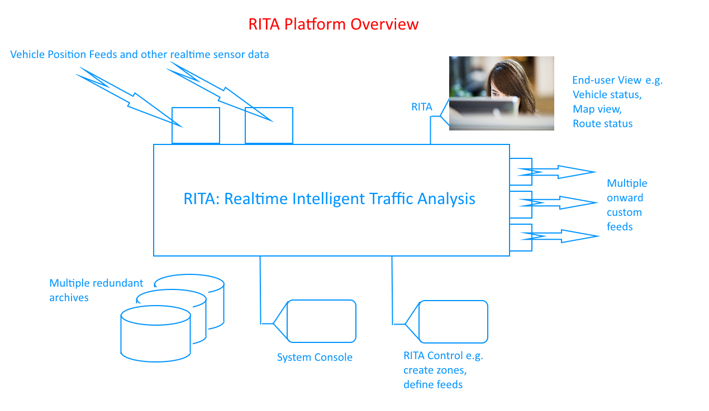
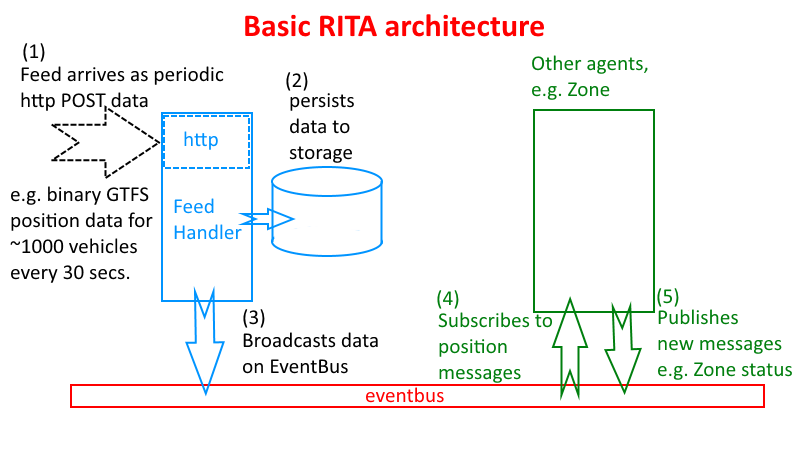
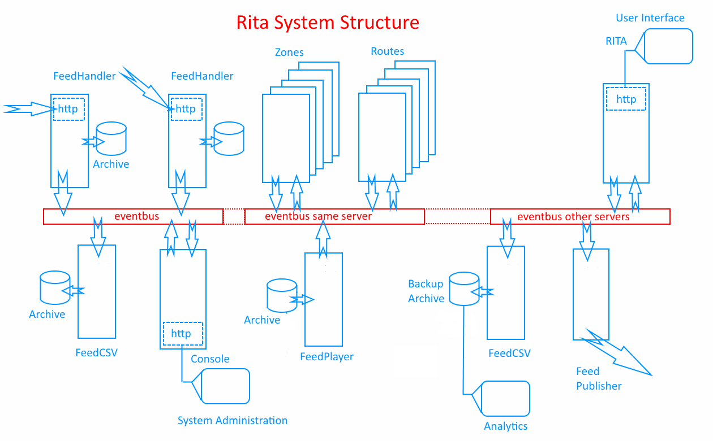
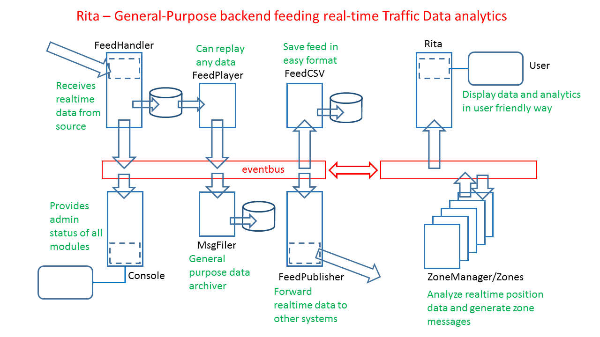

## RITA: Realtime Intelligent Traffic Analysis

# Part of the Smart Cambridge programme.

*This is a work-in-progress, not all features below are complete, see Summary of system modules below and the
[TODO](TODO.md) list*

## Overview

This system, written in Java / [Vertx](https://vertx.io) is designed to receive 'real-time' vehicle
position feeds, do analysis on those position updates in real-time, and provide both web-based information
pages and also send messages based on user subscriptions. The system is intended to accomodate other 'sensor'
data as that becomes available.

In terms of system design, the platform is notable mainly in that:
- An asynchronous message-passing paradigm is at the core of the platform, i.e.
vehicle position data is received by the FeedHandler module in real-time, formatted as a a message,
and published in the system. Other modules will receive and process those messages, themselved publishing
derived messages such as a zone becoming congested.
- The [Vertx](https://vertx.io) library is used to provide a non-blocking framework for the server-side
Java code, with the RITA modules themselves designed to operate asynchronously and be non-blocking.
- Each module in the system (e.g. FeedHandler, FeedPlayer, Zone, Route, Vehicle) is designed to be an
independent agent or [actor](http://www.brianstorti.com/the-actor-model/), and the system design
supports configurations of arbitrary numbers of feeds, zones, users etc.

## User output expected from the system

The system will:
- allow the user to select the region, routes or vehicles they are interested in
- show where vehicles are on a map in real time
- replay any prior period of vehicle movements
- provide realtime status of vehicles moving through designated *zones*
- show the impact of any congestion on arrival times within a chosen bus route
- show the status of predicted bus arrivals at any bus stop
- allow the user to subscribe to messages that will warn of poor service on any route or zone.

## System Architecture Overview

The system is composed of Vertx modules (i.e. Verticles) that communicate via a clustered EventBus. Each module
is intended to represent an agent in the system. A FeedHandler can accept data via any custom means (currently http) and then
broadcast that realtime data via the EventBus, a Zone module can subscribe to these vehicle position events, generate its
own status update messages such as congestion alerts, and broadcast its own messages back onto the EventBus for other
modules to receive.

So Rita is *modular* and there is no particular limit on the number of modules that can be concurrently supported. A production
implementation is expected to have hundreds of zones and routes being monitored simultaneously.

The use of Vertx and the clustered EventBus allows Rita modules to be run in multiple instances on a single server, and
also across multiple distributed servers. This also allows the realtime data to be archived simultaneously in multiple locations.

Most current modules in the Rita platform are general purpose, i.e. the function is independent of the actual type of
realtime data received. The image below shows this division between (on the left) general-purpose modules
that have no interest in the actual type of realtime data received (e.g. the FeedHandler and MsgFiler) and
(on the right) those that interpret the data and produce derived analytics (i.e. particularly the Zone which interprets
the feed as vehicle position data and produces new messages indicating current zone transit times).

## Summary of system modules
*For more detail see the readme in each module directory*

### FeedHandler (see [FeedHandler README](src/main/java/uk/ac/cam/tfc_server/feedhandler))

Receives the realtime batched of vehicle position data (currently as GTFS format binary data as
an http POST every 30 seconds) and parses/publishes the data as a 'json' message on the Vertx eventbus.

FeedHandler also archives each post of binary data as a timestamped file in the server filesystem.

### FeedMaker (see [FeedMaker README](src/main/java/uk/ac/cam/tfc_server/feedmaker))

FeedMaker is in effect an enhanced 'FeedHandler' that can also GET data sources that do not themselves
provide a real-time POST 'push'-style feed, i.e. it will *poll* a website periodically, immediately store the data in the raw
format in which it was received, and parse the data and publish it as a message on the EventBus.

Like FeedHandler, FeedMaker publishes feed data to the EventBus to use MsgFiler to store the json parsed data it generates.

### EverynetFeed (see [FeedMaker README](src/main/java/uk/ac/cam/tfc_server/everynet_feed))

This is a slightly specialized version of FeedHandler that is able to interpret the data received from LoraWAN sensors on the
Cambridge Sensor Network (currently based on Everynet gateways).

### Console (see [Console README](src/main/java/uk/ac/cam/tfc_server/console))

Designed to be used by admin users, the Console presents a user webpage reporting status.
Each module in the system reports its 'up' status regularly on the Vertx eventbus, and the console
listens for these messages and dynamically adds status reporting areas to the web page. Any module can
also transmit general log messages to the console.

It is intended to add a command-line in the console, to provide convenient web-based administration of
some aspects of the system.

### Zone (see [Zone README](src/main/java/uk/ac/cam/tfc_server/zone))

A Zone is provided with configuration parameters defining the geographic area of interest (as a
general polygon) and is assumes to have a 'start line' and a 'finish line'.  The Zone subscribes
to FeedHandler or FeedPlayer messages and Vehicles will be
tracked that enter the Zone by crossing that start line, and also leaving the Zone by crossing
the finish line.  A typical Zone will be a segment of road, or a polygon covering a segment of
a bus route along multiple roads. The Zone sends update messages when vehicles are found to
be moving more slowly that usual across the zone.

### ZoneManager (see [ZoneManager README](src/main/java/uk/ac/cam/tfc_server/zonemanager))

A ZoneManager is able to dynamically start multiple Zones, all listening to the same FeedManager or
FeedPlayer, and reporting their updates to a common 'zone update' address.

### MsgFiler (see [MsgFiler README](src/main/java/uk/ac/cam/tfc_server/msgfiler))

MsgFiler is a general-purpose module that can be configured to subscribe to messages on the 
EventBus and store them in the filesystem.

### MsgRouter (see [MsgRouter README](src/main/java/uk/ac/cam/tfc_server/msgrouter))

MsgRouter subscribes to messages on the EventBus and POST's them to URL destinations.

#### MsgRouter special support for EverynetFeed

Although the EventBus -> Http POST MsgRouter message routing capability is general,
MsgRouter can recognize message streams from an EverynetFeed feed handler and
use a lookup table to decide where to forward the messages to.  This 'routing table'
is initialized on startup by reading from a PostgreSQL database, and then asynchronously
updated with EventBus messages as sensors and destinations are added.  It is expected the updates
originate from a user web form in [tfc_web](https://github.com/ijl20/tfc_web) and are then
POSTED to HttpMsg (see below) to be forwarded to MsgRouter as EventBus 'management' messages.

### HttpMsg (see [HttpMsg README](src/main/java/uk/ac/cam/tfc_server/httpmsg))

HttpMsg is a generalized Vertx module which can receive Json packets as http POST's and then
send that data as a message on the EventBus. [tfc_web](https://github.com/ijl20/tfc_web) uses this
to send (e.g.) an "add_sensor" or "add_destination" message to MsgRouter (see above).

### FeedCSV (see [FeedCSV README](src/main/java/uk/ac/cam/tfc_server/feedcsv))

A FeedCSV module subscribes to a FeedHandler or FeedPlayer feed, and writes the vehicle position data
as CSV (comma-delimited ascii text) files in the server filesystem. The idea is simply that this may be
a more convenient or longer-term viable format for the archive of vehicle position data
than the originally received GTFS-format binary data (protobuf).

### StaticServer (see [StaticServer README](src/main/java/uk/ac/cam/tfc_server/staticserver))

StaticServer is a simple HTTP server for serving static files. This is useful with the Rita verticles
running behind an Nginx reverse proxy, with /static/* requests redirected to this server.

In general the verticles with a web interface (like Rita itself) also include a Vertx 'StaticHandler'
on their http router so they can operate independently for testing, but in the production config all static
http requests are redirected to this verticle.

### DataServer (see [DataServer README](src/main/java/uk/ac/cam/tfc_server/dataserver))

DataServer is an HTTP server supporting templated pages (currently using Vertx Handlebars support) which
serves templated web pages populated with data from the Rita platform.

For maximum robustness and performance, there is no live data on these pages. I.e. DataServer does not need
to provide WebSocket or EventBus bridging to these pages as is provided by Rita for the more complex live data pages.
All data is embedded into the page (as JSON data) before it is returned to the browser, like most traditional
server-side scripted pages.

### Batcher (see [Batcher README](src/main/java/uk/ac/cam/tfc_server/batcher))

Batcher, and its main class BatcherWorker, provides the *synchronous* data processing capability of the
Rita platform.

Note that the verticles of the Rita platform (such as FeedHandler, Zone, MsgFiler) are designed to operate
asynchronously, receiving and processing data and user requests and storing or presenting derived analytics.
The Rita platform is designed to operate comfortably with the real-time data rates expected, and in fact the
FeedPlayer verticle can replay data at much higher rates (such as 50x normal speed) with the platform
continuing to function in the normal way. Actually the system has been run in this way at over 500x
'real-time' speed but at these rates it should be recognised a better synchronous processing approach would
be appropriate (hence Batcher / BatcherWorker).

But at some level of acceleration, a limit will be reached where the *downstream* processing verticles
can't keep up with the rapidity of the feed data, and the lightweight approach taken by both Rita and the
Vertx platform is to assume data messages can simply be missed without the system falling apart.

The Batcher module is designed to be used where the simple acceleration provided by a FeedPlayer running at,
say, 50x normal speed is not enough. Batcher spawns worker threads (running a class called BatcherWorker)
which *synchronously* read through historic feed data and call the Rita processing routines (such as Zone
calculations) synchronously for each data point, synchronously storing analytics data as required.

A BatcherWorker configured to process a day's worth of vehicle position data will (as a simple benchmark,
processing the same set of Cambridge region Zones)
acheive a processing speed up of approximately 7500x over the original real-time data rate.

### Route *(planned)*

It is intended that Route modules will act as 'agents' on behalf of each bus route, e.g. the Citi-4
agent will subscribe to FeedHandler messages for vehicles on the Citi-4 route, and Zone messages
relevant to the Citi-4 route, to provide status and messages pertaining to the Citi-4 route (such
as likely delays and predicted journey times.

### Vehicle *(planned)*

It is possible we should have an agent-per-vehicle, i.e. a module that subscribes to the FeedPlayer or
FeedComposer that only has an interest in a given vehicle, and maintains status and generates messages
relevant to that vehicle. Not sure...

### Stop *(planned)*

It is possible we should have an agent-per-bus-stop, listening to appropriate messages and updating the
status of that stop and its timetable.

### Rita (see [Rita README](src/main/java/uk/ac/cam/tfc_server/rita))

Note that the 'user interface' to the Intelligent City Platform is primarily provided by
[tfc_web](https://github.com/ijl20/tfc_web).  Rita enables some web access in part to test functionality
before it is implemented in tfc_web.

Rita is the Vertx module providing the agent that acts on behalf of the general web *user*, e.g. it can
subscribe to the FeedHandler and show the position of vehicles on a map, or can display the
status of selected zones by subscribing to those messages.

Rita can equally provide most end-user functions using re-played data from the archive (i.e. using
a FeedPlayer) such that users can study exactly what did happen when a significant traffic
issue occurred.

