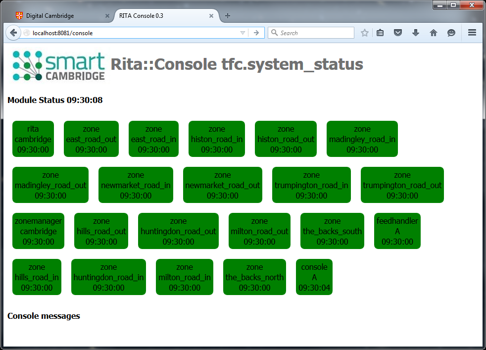

##  [RITA](https://github.com/ijl20/tfc_server) &gt; Console

Console is part of the RITA Realtime Intelligent Traffic Analysis platform,
supported by the Smart Cambridge programme.

## Overview

Console provides an HTTP web interface for administrative users of the platform which dynamically displays 'up'
status of the various modules currently live in the system and also allows any module to publish a log
message to be reported on the Console web page.

Each other module in the system repeatedly publishes 'status UP' messages to a system-defined
eventus address and the Console will flag that module as failing if it hasn't been heard from
in a defined period.  Part of the 'status UP' message is a time period (typically 15 seconds)
for which that UP message will be valid.

Console communicates with the web browser via a defined eventbus address permitted to flow over
the [javascript eventbus bridge](http://vertx.io/docs/vertx-tcp-eventbus-bridge/java/).
