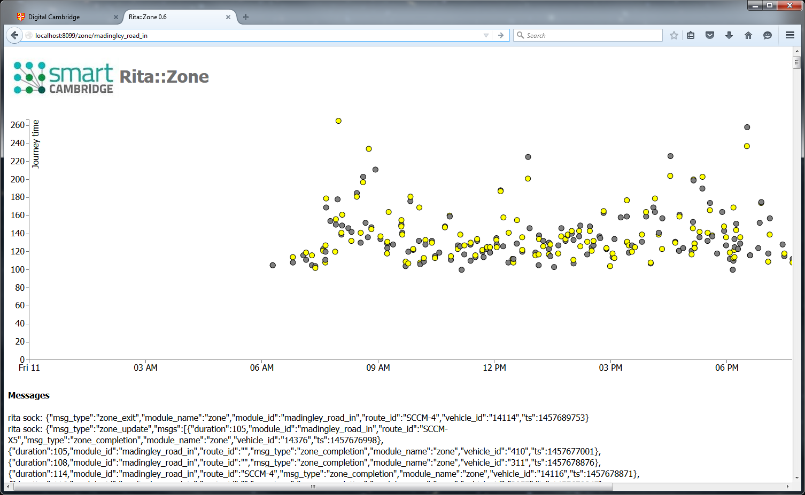
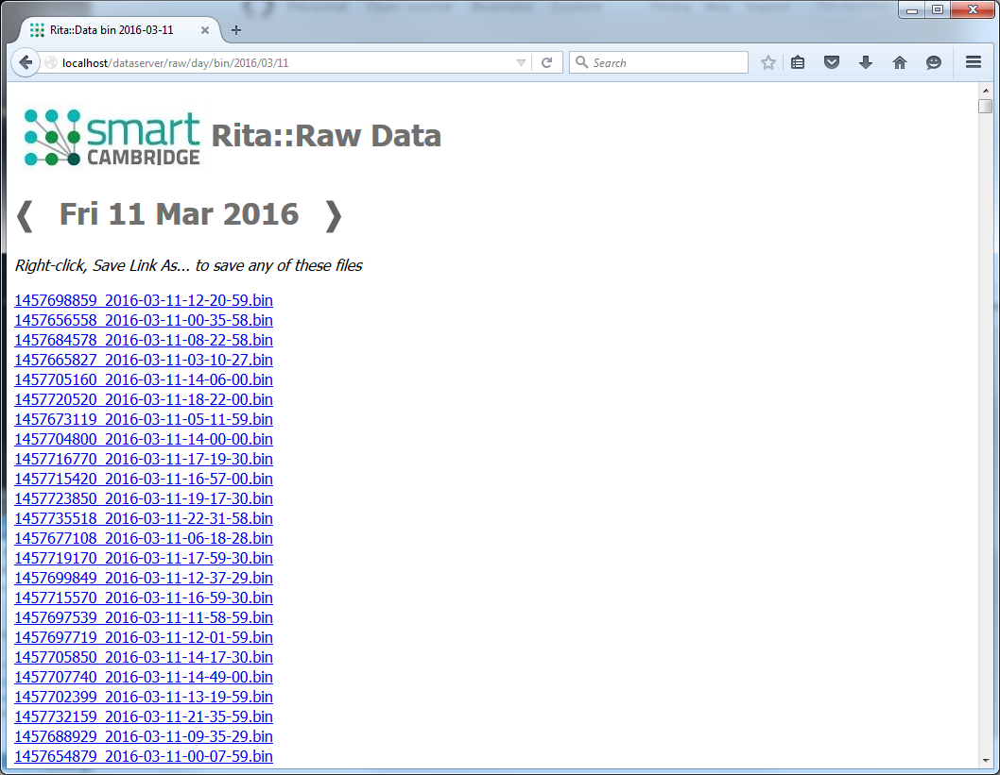

# [Rita](https://github.com/ijl20/tfc_server) &gt; DataServer

DataServer is part of the RITA Realtime Intelligent Traffic Analysis platform,
supported by the Smart Cambridge programme.

## Overview

DataServer is an http server for serving templated content containing data from
the Rita platform. DataServer does not use WebSockets or EventBus bridging to the
user's web page, and populates the page with the required data before it is
delivered to the end user, much like any other traditional server-side scripted
web pages. This differs from the pages delivered by the Rita verticle which are
designed to be real-time to the end-user and are more demanding in terms of the
technology required to support this.

DataServer is configured via Vertx application config(), see examples in the
main/resources directory.

Pages served by DataServer are defined in external classes:

### DataPlot

DataPlot will render an XY plot of the transit times for a zone on a given day by
reading the *pre-computed* transit times already archived.

### DataRaw

DataRaw provides web pages supporting the download of 'raw' data files, e.g.
the binary GTFS bus position files.

### API

DataServer is the main TFC module that provides the http request-based API, see
[API Readme](../../../../../../../../README_API.md)

